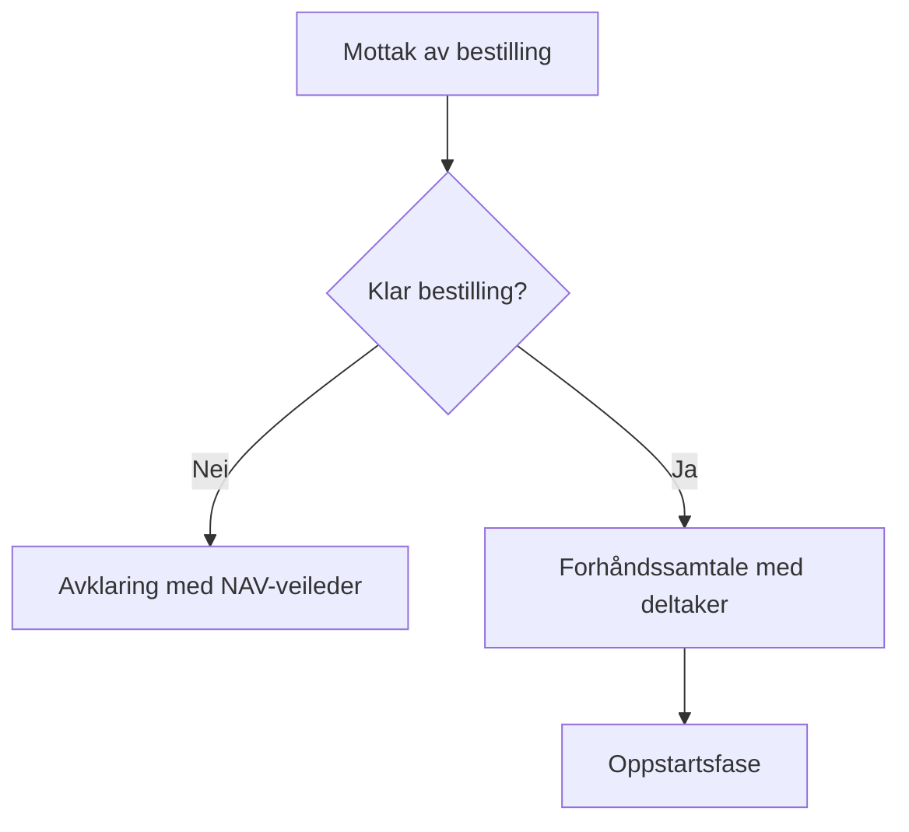

# CLAUDE.md — SPS AFT Håndbok

Intern faglig håndbok for jobbkonsulenter hos Sandnes Pro-Service (SPS),
bygget med Docusaurus v3. Håndboken dekker metodikk, arbeidsgang og faglig
grunnlag for Arbeidsforberedende trening (AFT).

> **Håndboken er Spor B** i det pågående fagutviklingsprosjektet
> «Et sterkt og samlet AFT» (prosjektgruppe: Siri og Bjarte, 2026).
> Innholdet skal gi jobbkonsulentene felles språk, rammer, rutiner og verktøy.

---

## Om virksomheten og prosjektet

### Sandnes Pro-Service (SPS)

SPS er en etablert tiltaksleverandør med lang erfaring innen arbeidsinkludering.
Visjon: **«Vi skaper muligheter»** — løsningsfokusert tilnærming, tro på
menneskers potensiale for endring uansett utgangspunkt.

**Verdier:** Raus · Fleksibel · Kompetent

**Tiltak etter avtale med Nav:**
- Arbeidsforberedende trening — AFT (48 plasser)
- Vilje Viser Vei — AFT VVV (12 plasser)
- Varig Tilrettelagt Arbeid — VTA (140 plasser)

**Organisering:** Flat struktur. Jobbkonsulenter i sosialfaglig avdeling,
to sosialfaglige veiledere knyttet til VTA, avdelingsleder sosialfag med
personal- og fagansvar.

### Pågående fagutviklingsprosjekt

**«Et sterkt og samlet AFT»** — fagutvikling, rutiner og verktøy (2026).
Prosjektgruppe: Siri og Bjarte. Sist oppdatert: 15.04.26.

**Overordnet mål:** Et sterkt og samlet AFT-team som er trygg på egen
kompetanse, selvstendig i sine faglige vurderinger og utrustet med gode
verktøy og metodekunnskap.

**To parallelle spor:**
- **Spor A** — Teamutvikling og felles retning (involverer hele teamet):
  felles forståelse av oppdraget, koble praksis til SE/MI/LØFT, identifisere
  variasjon og forbedringsbehov, faglig kompetanseheving.
- **Spor B** — Rutiner, rammer og verktøy (drives av prosjektgruppen):
  kartlegge og revidere rutiner, forbedre maler/sjekklister/kartleggingsverktøy,
  dokumentere og implementere. **Håndboken er primær leveranse i Spor B.**

**Aktuelle prioriteringer nå (basert på ny kravspek):**
- Øke andelen deltakere i ekstern arbeidspraksis ved 3 måneder
- Redusere andelen deltakere i intern arbeidspraksis
- SMART-mål: Strukturert, Målrettet, Attraktivt, Realistisk, Tidsavgrenset

**Høringsnotat 27.06.2025** — fem endringer i tiltaksforskriften kap. 13:
1. Arbeidsutprøving i ordinært arbeidsliv som **krav** (ikke bare tilbud)
2. Formell opplæring kan skje parallelt med AFT
3. Oppfølging etter ansettelse/lærekontrakt er nå hjemlet
4. Sluttrapport tas inn i forskriften
5. Differensierte satser etter faktisk deltakelse

### Tiltaksforløpet — SE-fasene + 4 spor

**Fasene 1–5 i tiltaksforløpet ER EUSEs femtrinnsmodell for SE** — dette er
ikke to separate ting. SE er det strukturelle rammeverket for hele arbeidsgangen,
ikke bare én metodikk blant flere. MI er primærrammeverk for all veiledning
og relasjonsarbeid gjennom hele forløpet.

| Fase | SE-trinn | Kravspek |
|---|---|---|
| 1. Innledende kontakt | Trinn 1: Innledende kontakt og samarbeidsavtale | 4a (del) |
| 2. Yrkeskartlegging | Trinn 2: Yrkeskartlegging og karriereplanlegging | 4a |
| (2.5) Intern arena | *SPS-spesifikt — ikke del av SE* | 4b (unntak) |
| 3. Finne jobb / utdanning | Trinn 3: Finne en passende jobb | 4d |
| 4. Samarbeid med arbeidsgiver | Trinn 4: Samarbeid med arbeidsgivere | 4d–4e |
| 5. Opplæring og oppfølging | Trinn 5: Opplæring og trening | 4c, 4e–4f |

Fase 2.5 (intern arena) er et SPS-tilpasning for målgruppen — et tidsavgrenset
virkemiddel som avviker fra SE-logikken og alltid krever faglig begrunnelse.

**4 spor** (pågår parallelt gjennom hele tiltaket):
- Kvalifisering · Karriere · Mestring · Struktur & rammer

Innhold og figurer i håndboken skal speile dette rammeverket. En interaktiv
prototype finnes — koordiner med Siri om tilgang og status.

### Håndbokens formål og målgruppe

Håndboken er et internt faglig referanseverk for **jobbkonsulenter** — både
nyansatte og erfarne. Den er ikke offentlig tilgjengelig.

**To bruksmønstre:**
- **Nyansatte:** Sekvensiell innføring fra start til slutt. Onboarding-sti
  gjennom metodikk, tiltaksløp og praktisk arbeidsgang.
- **Erfarne:** Oppslagsverk for oppfriskning, fordypning og kvalitetssikring
  av egen praksis.

**Innholdsnivåer** markeres konsekvent med tags i frontmatter:
```mdx
tags: [innføring]      # Grunnleggende, nyansatte
tags: [oppfriskning]   # Kjent stoff, rask påminnelse
tags: [fordypning]     # Teoretisk dybde, erfarne
```

### Kunnskapsbase

Dokumenter og kilder ligger i `knowledge_base/` — kun for utvikling/innholdsproduksjon,
ikke del av den deployede appen. Primærkilder:

| Fil | Innhold |
|---|---|
| `SPS - Løsningsbeskrivelse 2026_rev080426.pdf` | SPS' metodiske tilnærming og faglige grunnlag — autoritativ kilde for SPSs praksis |
| `Ny kravspesifikasjon for Arbeidsforberedende trening.pdf` | NAVs kravspesifikasjon (19.12.2025) — kapittel 13 i tiltaksforskriften |
| `aft_ny_spec (orig fonts).pptx` | Internpresentasjon mai 2026: hva er nytt i kravspeken og hva betyr det for SPS |
| `prosjekt-aft_utkast-innledning.pdf` | Utkast til prosjektbeskrivelse for fagutviklingsprosjektet (Spor A og B) |
| `SE Verktøykasse - av EUSE og SENO.pdf` | EUSE femtrinnsmodell for Supported Employment |
| `SE_oppsummering_jobbkonsulenter.md` | Bearbeidet innføring i SE for jobbkonsulenter |
| `LØFT.pdf` | Løsningsfokusert tilnærming |
| `MI....pdf` | Motiverende intervju |
| `GAP.pdf` | GAP-modellen for tilrettelegging |
| `Forhåndssamtale v0.1.pdf` | Prosedyre for forhåndssamtale |
| `Tiltaksløp - deltaker.pdf` | Visuell oversikt over tiltaksløpet |
| `Tidslinje.pdf` | Tidslinje-figur for tiltaksperioden |

---

## Faglig plattform

SPS' metodikk bygger på fire bærende tilnærminger som er gjennomgående
i alle faser av tiltaket. Bruk disse som faglig ramme i alt innhold.

### Supported Employment (SE)
**Strukturelt rammeverk for hele tiltaksløpet** — fasene 1–5 i tiltaksforløpet
ER SE-trinnene (se tabell i seksjonen over). SE er ikke én metodikk blant
flere; det er arbeidsgangens grunnleggende logikk.

Grunnlogikk: **place–train–maintain** (ikke train-then-place).
Tre kriterier for SE: (1) lønnet arbeid, (2) ordinært arbeidsmarked,
(3) tidsubegrenset individuelt tilpasset bistand.

### Motiverende intervju (MI)
**Primærrammeverk for all veiledning og relasjonsarbeid** gjennom hele
tiltaksforløpet — ikke bare i samtaler, men som grunnholdning i enhver
interaksjon med deltaker.
Grunnverdier: partnerskap, aksept, medfølelse, nysgjerrighet.

### Styrkebasert tilnærming
Gjennomgående i alle faser. Fokus på deltakers ressurser, ferdigheter og
interesser — ikke mangler og begrensninger.

### Karriereveiledning
Gjennomgående prosess, særlig tyngde i fase 2. Forankret i Nasjonalt
kvalitetsrammeverk (HK-dir). Bruker Karriereverktøy (RIASEC) som primærplattform.

### Tilstøtende rammer
- **LØFT** — løsningsfokusert tilnærming
- **GAP-modellen** — tilrettelegging i arbeidssituasjoner
- **Customized Employment (CE)** — jobbsnekring og skreddersydde stillinger
- **Brukerperspektiv** — deltaker er aktiv aktør, ikke passiv mottaker
- **IPS** (kjennskap, ikke primær metodikk) — for deltakere med psykisk helse/rus

### Verktøy jobbkonsulentene bruker

| Verktøy | Formål | Målgruppe |
|---|---|---|
| Karriereverktøy (RIASEC) | Interessekartlegging, yrkesutforsking | Alle |
| Karrierestyrker | Myke ferdigheter og jobbfastholdelse | Alle |
| ASIAS | Karriereveiledning autismespekter | Autismespekter |
| JobPics | Bildebasert RIASEC | Liten yrkeserfaring, lese-/skrivevansker |
| SCI (Structured Career Interview) | Strukturert karrieresamtale | Supplement |
| Livshjulet | Kartlegge livssituasjon | De fleste, særlig ved livsbelastninger |
| HK-dir grunnleggende ferdigheter | Testing og læring (lesing/skriving/regning) | Begrenset grunnleggende |
| Systematisk observasjon | Strukturert observasjon i arbeidssituasjoner | Alle i arbeidstrening |
| MI (Motiverende intervju) | Samtalemetodikk | Gjennomgående |
| Realkompetansevurdering | Uformell kompetanse mot læreplaner | Rogaland fylkeskommune |

---

## Teknisk stack

- **Framework:** Docusaurus v3 (TypeScript — alltid `.tsx`/`.ts`, aldri `.jsx`/`.js`)
- **Pakkebehandler:** pnpm — bruk alltid `pnpm`, aldri `npm` eller `yarn`
- **Innhold:** MDX med React-komponenter der det gir verdi
- **Styling:** Classic preset, CSS modules for komponentspesifikk styling
- **Språk:** Alt innhold på norsk bokmål. Kodenavn, filnavn, variabelnavn,
  komponentnavn og props på engelsk.
- **Tilgang:** Intern — ikke offentlig. Ingen autentisering i Docusaurus selv
  (håndteres på infrastrukturnivå).
- **Vedlikehold:** Bjarte alene via Claude Code. Hold koden fremtidskompatibel
  for eventuell CMS-integrasjon (Decap/Tina) dersom flere redaktører ønskes
  — unngå harde antagelser om fil-eierskap.

---

## Skills

Følgende skills er installert og aktive. Bruk dem eksplisitt der de er relevante.

### Docusaurus og teknisk innhold

**`specweave:docusaurus`** — Docusaurus 3.x ekspert
Bruk ved: konfigurasjon av `docusaurus.config.ts`, sidebars, MDX-komponenter,
admonitions, tabs, theming, versioning, plugin-oppsett.

**`specweave:technical-writing`** — Teknisk skriving
Bruk ved: strukturering av faglige guider, informasjonsarkitektur,
dokumentasjons-as-code-mønstre, klarspråk og tilgjengelighet.

### Innholdskvalitet

**`pbakaus/impeccable:polish`** — Finpuss og kvalitetskontroll
Bruk ved: siste kvalitetssjekk av MDX-sider, typografi, konsistens i terminologi,
tilgjengelighet og helhetlig gjennomgang før «ferdigstilt».

**`pbakaus/impeccable:typeset`** — Typografi og formatering
Bruk ved: overskriftshierarki, linjebryting, konsistent bruk av admonitions.

**`pbakaus/impeccable:critique`** — Kritisk gjennomgang
Bruk ved: vurdering av om innhold er faglig presist, logisk strukturert og
tilpasset målgruppen (jobbkonsulenter på ulike nivåer).

### Planlegging og gjennomføring

**`obra/superpowers:writing-plans`** — Implementasjonsplaner
Bruk ved: planlegging av nye seksjoner, innholdskart og strukturert skrivearbeid.
Lagrer planer i `docs/superpowers/plans/`.

**`obra/superpowers:executing-plans`** — Utføring av planer
Bruk ved: gjennomføring av skrive- og konfigurasjonsplaner steg for steg.

**`obra/superpowers:brainstorming`** — Idéutvikling
Bruk ved: strukturering av nye emner, informasjonsarkitektur og prioritering.

**`obra/superpowers:subagent-driven-development`** — Parallell utføring
Bruk ved: større innholdsgenerering der seksjoner kan skrives parallelt.

### Visualisering

**`sickn33/antigravity-awesome-skills:d3-viz`** — D3.js visualisering
Bruk ved: egendefinerte SVG-figurer (tiltaksforløp, aktørrelasjoner, nettverk,
femtrinnsmodellen), nettverksgrafer, hierarkier.

### Meta

**`anthropics/skills:skill-creator`** — Lag og forbedre egne skills
Bruk ved: prosjektspesifikke skills, f.eks. AFT-terminologi eller
observasjonsmalverktøy.

**`vercel-labs/skills:find-skills`** — Finn nye skills
Bruk ved: behov for kapasitet som ikke dekkes av installerte skills.

---

## Informasjonsarkitektur

```
docs/
├── intro.mdx                           # Velkommen — hva er AFT hos SPS, slik bruker du håndboken
├── kom-i-gang/
│   ├── index.md                        # Leseveileder for nyansatte
│   └── jobbkonsulentens-rolle.md       # Rolle, 7 ferdighetsområder (EUSE), etikk, leveregler
│
├── tiltakslopet/                       # 6 faser · 4 spor (rammeverket)
│   ├── index.md                        # Oversikt — figur over faser og spor
│   ├── fase-1-innledende-kontakt.md    # Bestilling, forhåndssamtale, oppstart, første møte
│   ├── fase-2-yrkeskartlegging.md      # Kartlegging, karriereveiledning, yrkesmål, plan
│   ├── fase-2b-intern-arena.md         # Intern arena — når, hvorfor, risiko, tidsramme
│   ├── fase-3-finne-jobb.md            # Jobbutvikling, jobbmatch, jobbsnekring (CE)
│   ├── fase-4-arbeidsgiver.md          # Samarbeid arbeidsgiver, avtale, informasjonsplikt
│   ├── fase-5-oppfolging.md            # Tett oppfølging i praksis, gradvis nedtrapping
│   └── avslutning.md                   # Avslutning, overgang til arbeid, sluttrapport
│
├── plan/                               # Plan for tiltaksgjennomføring
│   ├── utarbeide-plan.md               # Planarbeid, eierskap, SMART-mål
│   ├── oppdatere-og-dele.md            # 4-ukers frist, 3-månederssyklus, Nav-dialog
│   └── forlengelse-og-avslutning.md    # Kriterier, dokumentasjon, varsling
│
├── metodikk/                           # Faglig metodikk og tilnærminger
│   ├── supported-employment.md         # SE — femtrinnsmodell, place-train-maintain
│   ├── styrkebasert.md                 # Styrkebasert tilnærming
│   ├── motiverende-intervju.md         # MI — grunnverdier og teknikker
│   ├── karriereveiledning-metode.md    # Karriereveiledning som metode (RIASEC, SCI)
│   ├── gap-modellen.md                 # GAP — tilrettelegging i arbeidssituasjoner
│   └── loft.md                         # LØFT — løsningsfokusert tilnærming
│
├── samarbeid/                          # Relasjoner og samarbeidspartnere
│   ├── nav-samarbeid.md                # Kommunikasjon, plan, rapportering, fraværsrutiner
│   ├── arbeidsgiversamarbeid.md        # Bygge og vedlikeholde relasjoner, jobbutvikling
│   └── andre-aktorer.md                # Helsetjenester, opplæringskontor, fylkeskommune
│
├── verktoy/                            # Konkrete verktøy og maler
│   ├── karriereverktoy.md              # Karriereverktøy, RIASEC, SCI, JobPics, ASIAS
│   ├── livshjulet.md                   # Livshjulet — bruk og tolkning
│   ├── observasjon.md                  # Systematisk observasjon — struktur og dokumentasjon
│   ├── grunnleggende-ferdigheter.md    # HK-dir, kartlegging og opplæring
│   └── dokumentasjonsmaler.md          # Maler for plan, rapport, avtale, observasjon
│
├── regelverk/                          # Rammer og krav
│   ├── kravspesifikasjonen.md          # NAVs kravspesifikasjon (kap. 13) — sammendrag
│   ├── varighet-og-deltakelse.md       # Varighet, 3-mnd-frist, deltakelsesprosent, tilskudd
│   └── personvern.md                   # Taushetsplikt, samtykke, GDPR
│
└── fordypning/                         # For erfarne — teoretisk dybde
    ├── psykisk-helse.md                # Psykisk helse i arbeidsrettet kontekst
    ├── autistisk-utbrenthet.md         # Autistisk utbrenthet og masking
    ├── epistemic-trust.md              # Epistemic trust og MBT/AMBIT
    └── sosialt-arbeid.md               # Fagtradisjonen sosialt arbeid (person-i-situasjon)
```

Strukturen kan justeres ved behov. Legg alltid nye sider i riktig kategori
og oppdater `sidebars.ts` tilsvarende.

---

## MDX-konvensjoner

### Frontmatter (påkrevd på alle sider)

```mdx
---
title: Sidetittel
description: Kort beskrivelse for søk og metadata (1-2 setninger)
sidebar_label: Kortform for sidebar
sidebar_position: 1
tags: [innføring]   # innføring | oppfriskning | fordypning — velg ett
---
```

### Admonitions

```mdx
:::tip Praktisk tips
Konkret råd jobbkonsulenten kan handle på direkte.
:::

:::info Faglig kontekst
Utdypende faglig informasjon eller begrepsavklaring.
:::

:::warning Vær oppmerksom
Fallgruver, etiske hensyn eller situasjoner som krever skjønn.
:::

:::note Regelverksforankring
Kobling til kravspesifikasjonen eller tiltaksforskriften.
:::
```

### Innholdsnivå-admonition (bruk på seksjoner, ikke hele sider)

```mdx
:::info[Fordypning]
Denne seksjonen går dypere inn i det teoretiske grunnlaget.
Relevant for erfarne jobbkonsulenter eller ved faglig fordypning.
:::
```

### Visualisering og figurer

Velg verktøy etter figurtype:

| Figurtype | Verktøy | Begrunnelse |
|---|---|---|
| Flytdiagram med forgrening | Mermaid `flowchart` | Raskt, innebygd, versjonerbart |
| Sekvensdiagram | Mermaid `sequenceDiagram` | Innebygd, god nok |
| Tiltaksforløp / faser | React + SVG-komponent | Full layoutkontroll |
| Aktørrelasjoner (deltaker/NAV/arbeidsgiver) | React SVG-komponent | Mermaid håndterer dårlig |
| Femtrinnsmodellen (SE) | React SVG-komponent | Trenger visuell presisjon |
| RIASEC-profil | Recharts `RadarChart` | Interaktivt, kjent mønster |
| Tidslinje / tiltaksperiode | React + SVG eller Recharts | Full layoutkontroll |
| Kompleks nettverksgraf | D3 direkte | Kun når Recharts ikke strekker til |

**Komponentbibliotek** — plasser i `src/components/figures/`:

```
src/components/figures/
├── PhaseTimeline.tsx       # Tiltaksforløp med faser og varighet
├── ProcessFlow.tsx         # Lineær steg-for-steg uten forgrening
├── ActorRelationship.tsx   # Deltaker / NAV / arbeidsgiver / helse
├── SEFiveSteps.tsx         # EUSEs femtrinnsmodell
└── index.ts                # Re-eksporterer alle
```

**Konvensjoner for figurkomponenter:**
- Props og komponentnavn på engelsk, all synlig tekst på norsk
- Alltid `ResponsiveContainer` rundt Recharts-figurer
- Tilgjengelig: `role="img"` og `aria-label` på SVG-rotelementet
- Eksporter propstypen: `export interface PhaseTimelineProps { ... }`

### Mermaid-diagrammer

Kun for flytdiagrammer med forgrening og sekvensdiagrammer.

```mdx

```

---

## Terminologi

Bruk konsekvent SPS-terminologi. Dette er viktig for intern gjenkjennbarhet.

| Bruk | Ikke bruk |
|---|---|
| Tiltaksdeltaker / deltaker | Bruker, klient, kandidat |
| Jobbkonsulent | Konsulent, coach, veileder (for SPS-ansatte) |
| Tiltaksarrangør / SPS | Leverandør |
| NAV-veileder | Saksbehandler (unngå) |
| Avdelingsleder | Leder (upresist) |
| Arbeidsevnevurdering (AEV) | — |
| Plan for tiltaksgjennomføring | IOP (brukes ikke i AFT-kontekst) |
| Arbeidsforberedende trening (AFT) | — |
| Supported Employment (SE) | — (forkort kun etter første gang) |
| Jobbmatch | — |
| Jobbsnekring | Job carving (bare ved begrepsforklaring) |
| Place–train–maintain | — (forkort ikke) |
| Ordinært arbeidsliv / ordinær virksomhet | Normalt arbeid |
| Ekstern arbeidsplass | — |
| Intern arena | Skjermet arena (unngå normativt) |

---

## Skriveprinsipper

- **Klarspråk:** Skriv for en erfaren jobbkonsulent uten akademisk bakgrunn.
  Forklar fagbegreper første gang de introduseres.
- **Praksisrettet:** Koble teori til konkrete situasjoner fra AFT-hverdagen.
  «Hva gjør du når...» er bedre enn abstrakt teori alene.
- **To lesere:** Tenk på nyansatt (trenger forklaring) og erfaren (trenger
  konsis og presis tekst). Bruk innholdsnivå-tags og admonitions for å
  skille nivåene.
- **Nøytral faglig tone:** Presentér kunnskap og god praksis, ikke moralisering.
- **Ingen kjønnede pronomen** — bruk «jobbkonsulenten», «deltakeren» osv.
- **Kildebevissthet:** Henvis til forskning der det styrker innholdet.
  Primærkilder: EUSE (2010), Glemmestad & Kleppe (2019), Holland (1997),
  Haug et al. (2019), Levin (2021), Trondsen (2024).
- **SPS som kilde:** Løsningsbeskrivelsen er autoritativ for SPSs praksis.
  Når noe er «slik vi gjør det hos SPS», si det eksplisitt.

---

## Kommandoer

```bash
# Utviklingsserver
pnpm start

# Bygg
pnpm build

# Typekontroll
pnpm typecheck

# Installer avhengighet
pnpm add <pakke>
pnpm add -D <pakke>   # devDependency
```

---

## Sikkerhetsstatus for installerte skills

| Skill | Trust Hub | Socket | Snyk | Stars |
|---|---|---|---|---|
| `anthropics/skills:skill-creator` | ✅ | ✅ | ✅ | 126K |
| `vercel-labs/skills:find-skills` | ✅ | ✅ | ⚠️ Warn* | 17.8K |
| `obra/superpowers:*` | ✅ | ✅ | ✅ | 179K |
| `pbakaus/impeccable:*` | ✅ | ✅ | ✅ | 20.2K |
| `anton-abyzov/specweave:docusaurus` | ✅ | ✅ | — | 97 |
| `anton-abyzov/specweave:technical-writing` | ✅ | ✅ | — | 97 |
| `sickn33/antigravity-awesome-skills:d3-viz` | ✅ | ✅ | ⚠️ Warn* | 37.3K |

*Snyk Warn gjelder utdaterte avhengigheter i repoets verktøykjede,
ikke i SKILL.md-innholdet som Claude leser.
